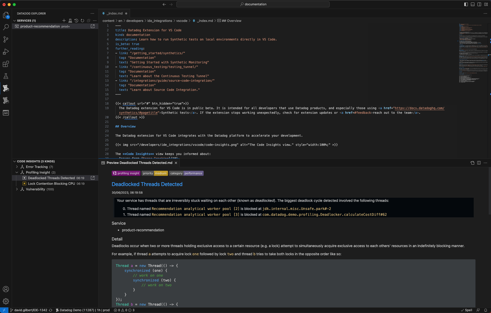
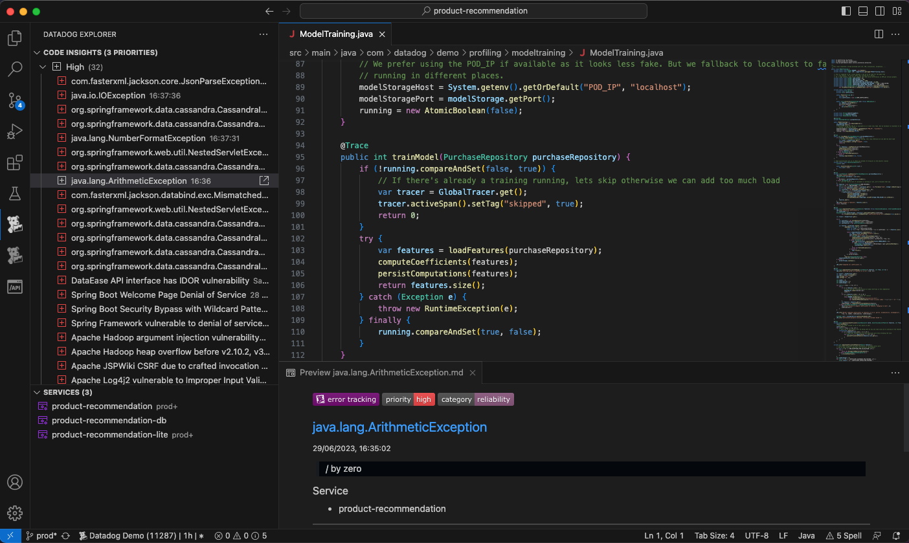
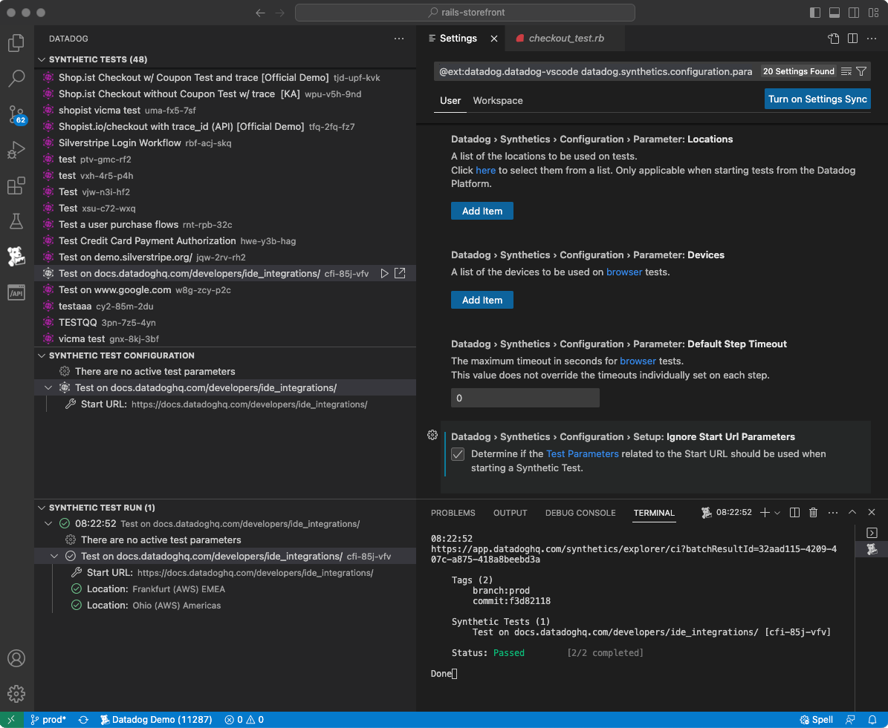
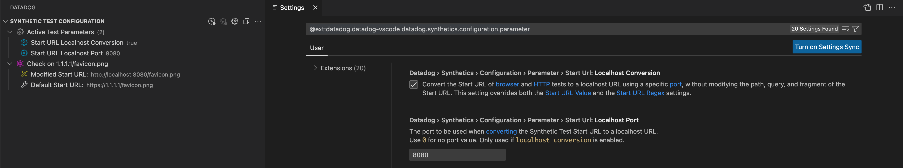
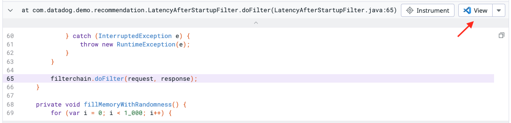
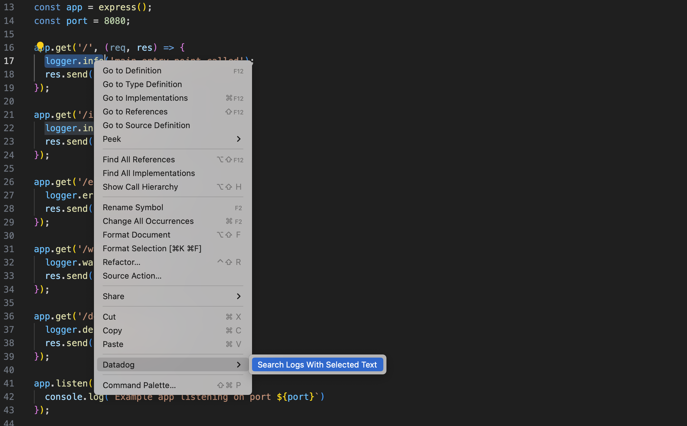

<!-- markdownlint-disable MD033 -->
<!-- markdownlint-disable MD041 -->

<h1> Datadog for VS Code </h1>

<!-- markdownlint-enable MD041 -->
<!-- markdownlint-enable MD033 -->

The [Datadog][datadog] extension for VS Code is in public beta. It is intended for all developers that use [Datadog][datadog] products. If the extension stops working unexpectedly, check for extension updates or [reach out to the team](#help-and-feedback).

## Overview

The [Datadog][datadog] extension for VS Code integrates with [Datadog][datadog] to accelerate your development.

<!-- markdownlint-disable MD033 -->
<!-- markdownlint-disable MD041 -->

 

<!-- markdownlint-enable MD041 -->
<!-- markdownlint-enable MD033 -->

The [**Code Insights**](#code-insights) view keeps you informed about:

- Issues from [Error Tracking][error_tracking]
- [Vulnerability][vulnerability_management] reports by Application Security Management
- [Flaky tests][flaky_test_management] detected by CI Visibility
- Profiling insights from [Watchdog Insights][watchdog]

The [**Synthetic Tests**](#synthetic-tests) feature allows you to:

- Run Synthetic tests on your local environments
- Set custom parameters without altering the original test definition
- See test results locally in VS Code and in Datadog to access additional information
- Test only what matters by executing relevant tests at the same time
- Create a list of most frequently used Synthetic tests by linking them to your workspace

The [**View in VS Code**](#view-in-vs-code) feature provides a link from Datadog directly to your source files.

The [**Logs Navigation**](#logs-navigation) feature will allow you to find some logs from your code.

## Requirements

- **A Datadog account**: The extension requires a [Datadog][datadog] account. If you're new to [Datadog][datadog]Datadog, go to the [Datadog website][datadog] to learn more about [Datadog][datadog]'s observability tools and sign up for a free trial.

## Code Insights

The **Code Insights** tree displays insights generated by the [Datadog][datadog] platform that are relevant to your code-base. The insights are grouped into three categories: performance, reliability, and security.

<!-- markdownlint-disable MD033 -->
<!-- markdownlint-disable MD041 -->

 

<!-- markdownlint-enable MD041 -->
<!-- markdownlint-enable MD033 -->

Code Insights include a detailed description for each issue, and links to:

- The related source code location
- The [Datadog][datadog] platform for additional information

You can dismiss individual insights and set filters to view the categories of insights that you are most interested to see.

## Synthetic Tests

The [Datadog][datadog] extension enables you to [run Synthetic HTTP tests and browser tests on local environments][synthetics_tunnel] directly in the IDE. You can identify and address potential issues resulting from code changes before they are deployed into production and impact your end users.

> We currently only support [HTTP API tests][api_tests] and [Browser tests][browser_tests].

<!-- markdownlint-disable MD033 -->
<!-- markdownlint-disable MD041 -->

 

<!-- markdownlint-enable MD041 -->
<!-- markdownlint-enable MD033 -->

### Run Synthetic tests locally

1. Select a Synthetic test to execute. You can search for specific tests by clicking the **Search** icon.
2. Change the test's configuration to convert the start URL and specify a `localhost` URL on the **Settings** page.
3. Run the test.

<!-- markdownlint-disable MD033 -->
<!-- markdownlint-disable MD041 -->

 

<!-- markdownlint-enable MD041 -->
<!-- markdownlint-enable MD033 -->

If you haven't set up Synthetic tests already, [create a test in Datadog][synthetics_create]. For more information about running tests on a local environment, see [Getting Started with API Tests][synthetics_started], [Getting Started with Browser Tests][synthetics_browser], and the [Continuous Testing Tunnel documentation][synthetics_tunnel].

### Permissions

By default, only users with the [Datadog Admin and Datadog Standard roles][datadog_default_roles] can create, edit, and delete Synthetic HTTP and browser tests. To get create, edit, and delete access to Synthetic HTTP and browser tests, upgrade your user to one of those two [default roles][datadog_default_roles].

If you are using the [custom role feature][datadog_custom_roles], add your user to any custom role that includes `synthetics_read` and `synthetics_write` permissions.

## View in VS Code

The **View in VS Code** feature provides a link from [Datadog][datadog] directly to your source files. Look for the button next to frames in stack traces displayed in the UI (for example, in [Error Tracking][error_tracking]):

<!-- markdownlint-disable MD033 -->
<!-- markdownlint-disable MD041 -->

 

<!-- markdownlint-enable MD041 -->
<!-- markdownlint-enable MD033 -->

> To use this feature, first configure [source code integration][source_code_integration] for your service.

## Logs navigation

You can navigate to the [Log Explorer][log_explorer] on the [Datadog platform][datadog] directly from your code source files. Select some text, right click, and look for the **Datadog > Search Logs With Selected Text** option.

<!-- markdownlint-disable MD033 -->
<!-- markdownlint-disable MD041 -->

 

<!-- markdownlint-enable MD041 -->
<!-- markdownlint-enable MD033 -->

> This feature requires you to sign in to [Datadog][datadog] and link some services.

## License

Please read this [End-User License Agreement][eula] carefully before downloading or using the Datadog Visual Studio Code Extension.

## Help and Feedback

To share your feedback, email [team-ide-integration@datadoghq.com][feedback_email] or create an issue in our [public repository][public_repo].

[synthetics_tunnel]: https://docs.datadoghq.com/continuous_testing/testing_tunnel/
[datadog]: https://www.datadoghq.com/
[synthetics_create]: https://app.datadoghq.com/synthetics/create
[synthetics_started]: https://docs.datadoghq.com/getting_started/synthetics/api_test/
[synthetics_browser]: https://docs.datadoghq.com/getting_started/synthetics/browser_test
[source_code_integration]: https://docs.datadoghq.com/integrations/guide/source-code-integration/
[datadog_default_roles]: https://docs.datadoghq.com/account_management/rbac/?tab=datadogapplication#datadog-default-roles
[datadog_custom_roles]: https://docs.datadoghq.com/account_management/rbac/?tab=datadogapplication#custom-roles
[feedback_email]: mailto:team-ide-integration@datadoghq.com
[error_tracking]: https://docs.datadoghq.com/tracing/error_tracking/
[vulnerability_management]: https://docs.datadoghq.com/security/application_security/vulnerability_management/
[flaky_test_management]: https://docs.datadoghq.com/continuous_integration/guides/flaky_test_management/
[watchdog]: https://docs.datadoghq.com/watchdog/insights/
[public_repo]: https://github.com/DataDog/datadog-for-vscode
[eula]: https://www.datadoghq.com/legal/software-licenses/vs-code
[api_tests]: https://docs.datadoghq.com/synthetics/api_tests/http_tests/?tab=requestoptions
[browser_tests]: https://docs.datadoghq.com/synthetics/browser_tests/?tab=requestoptions
[log_explorer]: https://docs.datadoghq.com/logs/explorer/
